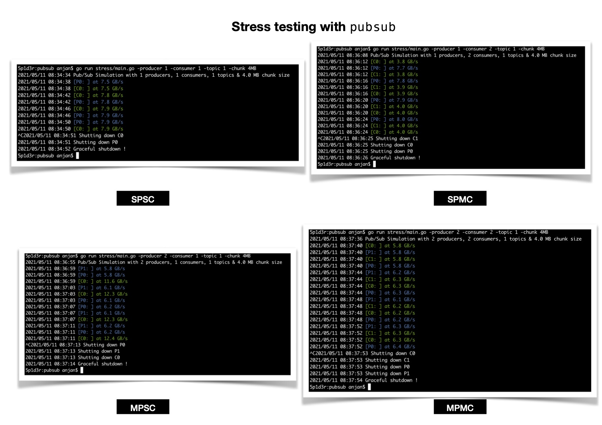

# pubsub
Embeddable, Lightweight, Sharded In-App Messaging in Go

## Motivation

After using few Pub/Sub systems in writing production grade softwares, I decided to write one very simple, embeddable, light-weight, sharded in-app messaging system using only native Go functionalities.

Actually, Go channels are **MPSC** i.e. multiple producers can push onto same channel, but there's only one consumer. You're very much free to use multiple consumers on single channel, but they will start competing for messages being published on channel i.e. all consumers won't see all messages published on channel. **MPMC** i.e. where multiple producers pushes messages to multiple consumers are also not directly implementable using channels.

Good thing is that Go channels are concurrent-safe. So I considered extending it to make in-application communication more flexible, while contending as less as possible by introducing consumer **shards** & consumer **message inboxes** i.e. resizeable buffer.

Following communication patterns can be used with higher level abstractions.

✌️ | Producer | Consumer
--- | --: | --:
Single | ✅ | ✅
Multiple | ✅ | ✅

## Design


## Stress Testing

For stress testing the system, I wrote one configurable [program](./stress) which makes running tests easy using various CLI argument combination.

Run it using with

```bash
go run stress/main.go -help
go run stress/main.go
```



## Usage

First create a Go project with **GOMOD** support.

```bash
# Assuming you're on UNIX flavoured OS

cd
mkdir test_pubsub

cd test_pubsub
go mod init github.com/<username>/test_pubsub

touch main.go
```

Now add `github.com/itzmeanjan/pubsub` as your project dependency

```bash
go get github.com/itzmeanjan/pubsub # v0.1.6 latest
```

And follow full [example](./example/main.go).

---

**Important**

If you're planning to use `pubsub` in your application

- You should first start pub/sub broker using

```go
// 2 consumer shards
broker := pubsub.New(2)

// Start using broker 👇
```

- If you're a publisher, you should concern yourself with only `PubSub.Publish(...)`

```go
msg := pubsub.Message{
    Topics: []pubsub.String{pubsub.String("topic_1")},
    Data:   []byte("hello"),
}
consumerCount := broker.Publish(&msg) // concurrent-safe
```

- If you're a subscriber, you should first subscribe to `N`-many topics, using `PubSub.Subscribe(...)`. 

```go
subscriber := broker.Subscribe(16, []string{"topic_1"}...)
```

- You can start consuming messages using `Subscriber.Next()`

```go
for {
    msg := subscriber.Next()
    if msg == nil {
        continue
    }
}
```

- Or you can listen to notification sent over channel & act

```go
for {
    select {
        case <-ctx.Done():
            // graceful shutdown
            return
        
        case <-subscriber.Listener():
            msg := subscriber.Next()
            // pulled messsage, act now
    }
}
```

- Check if any consumable message living in inbox

```go
if !subscriber.Consumable() {
    // nothing to consume
    return
}

// consume them by pulling : `subscriber.Next()`
```

- Add more subscriptions on-the-fly using `Subscriber.AddSubscription(...)`

```go
topicCount := subscriber.AddSubscription([]string{"topic_2"}...)
```

- Unsubscribe from specific topic using `Subscriber.Unsubscribe(...)`

```go
topicCount := subscriber.Unsubscribe([]string{"topic_1"}...)
```

- Unsubscribe from all topics using `Subscriber.UnsubscribeAll()`

```go
topicCount := subscriber.UnsubscribeAll()
```

- Destroy subscriber by `Subscriber.Destroy()`, which removes this subscriber's message inbox from broker's consumer shard - **No future message to be received.**

**And all set 🚀**

---

You can check package documentation [here](https://pkg.go.dev/github.com/itzmeanjan/pubsub)
