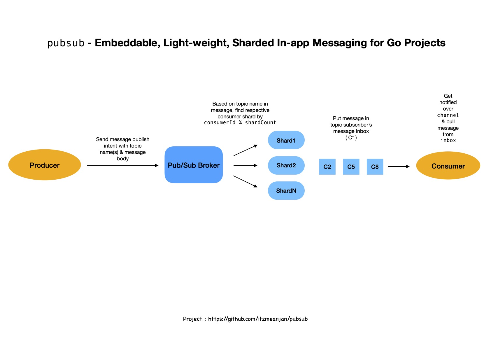
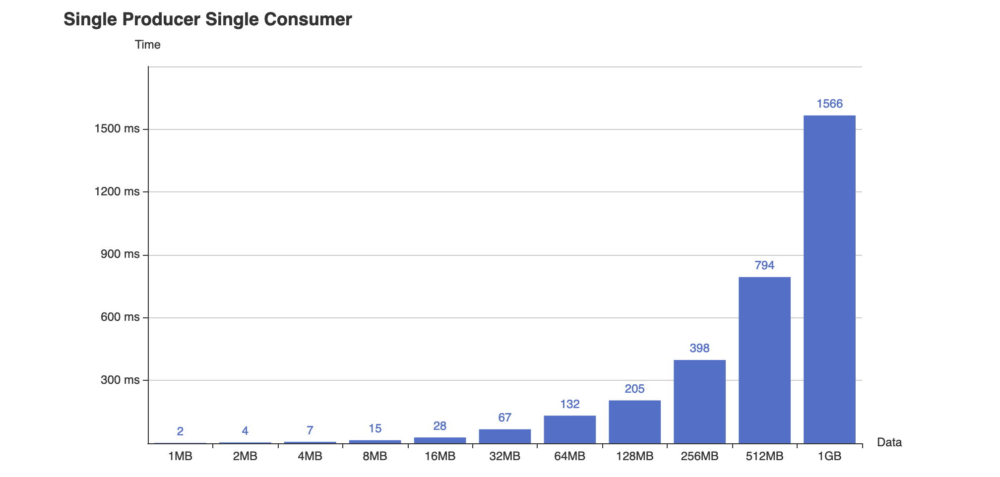
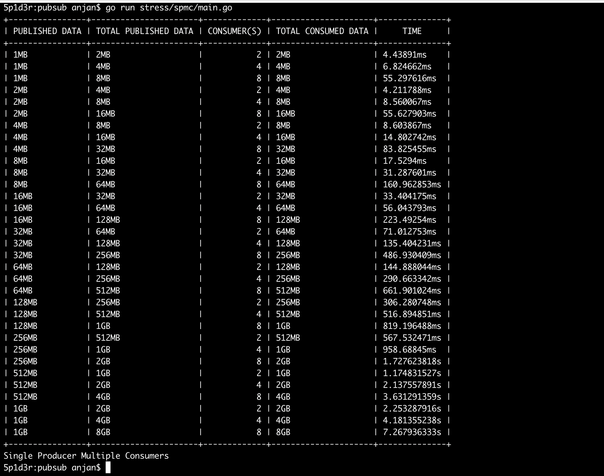
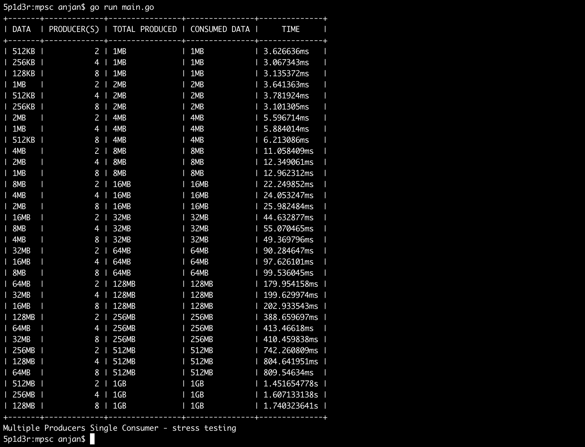
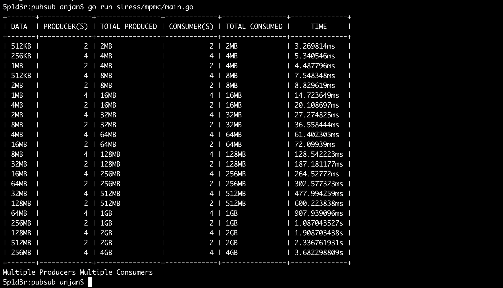
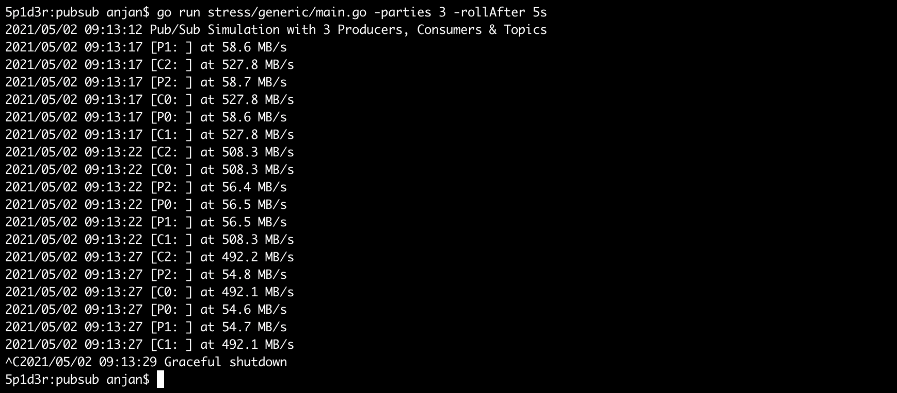

# pubsub
Embeddable Lightweight Pub/Sub in Go

## Motivation

After using several Pub/Sub systems in writing production grade softwares for sometime, I decided to write one very simple, embeddable, light-weight Pub/Sub system using only native Go functionalities i.e. Go routines, Go channels.

Actually, Go channels are **MPSC** i.e. multiple producers can push onto same channel, but there's only one consumer. You're very much free to use multiple consumers on single channel, but they will start competing for messages being published on channel i.e. all consumers won't see all messages published on channel.

Good thing is that Go channels are concurrent-safe. So I considered extending it to make in-application communication more flexible. Below is what provided by this embeddable piece of software.

✌️ | Producer | Consumer
--- | --: | --:
Single | ✅ | ✅
Multiple | ✅ | ✅

## Design



## Stress Testing

Stress testing using `pubsub` was done for following message passing patterns, where every message was of size **1024 bytes** & I attempted to calculate time spent for producing & consuming data under various configuration.

> If you may be interested in taking a look at stress testing [examples](./stress)









---

One generic simulation with **N** -parties & rolling average of data transferred is present [here](./stress/generic/main.go)



---

## Usage

First create a Go project with **GOMOD** support.

```bash
# Assuming you're on UNIX flavoured OS

cd
mkdir test_pubsub

cd test_pubsub
go mod init github.com/<username>/test_pubsub

touch main.go
```

Now add `github.com/itzmeanjan/pubsub` as your project dependency

```bash
go get github.com/itzmeanjan/pubsub # v0.1.1 latest
```

And follow full [example](./example/main.go).

---

**Important**

A few things you should care about when using `pubsub` in your application

- Though Go channels are heavily used in this package, you're never supposed to be interacting with them directly. Abstracted, easy to use methods are made available for you. **DON'T INTERACT WITH CHANNELS DIRECTLY. IF YOU DO, PLEASE BE CAREFUL.**
- When creating new subscriber, it'll be allocated with one unique **ID**. ID generation logic is very simple. **BUT MAKE SURE YOU NEVER MANIPULATE IT**

```js
last_id = 1 // initial value
next_id = last_id + 1
last_id = next_id
```

- If you're a publisher, you should concern yourself with either of
    - `PubSub.Publish(...)` [ **non-blocking** ]
    - or `PubSub.BPublish(...)` [ **blocking** ]
- If you're a subscriber, you should first subscribe to `N`-many topics, using `PubSub.Subscribe(...)`. You can start reading using
    - `Subscriber.Next()` [ **non-blocking** ]
    - `Subscriber.BNext(...)` [ **blocking** ]
    - `Subscriber.AddSubscription(...)` [ **add more subscriptions on-the-fly** ]
    - `Subscriber.Unsubscribe(...)` [ **cancel some topic subscriptions** ]
    - `Subscriber.UnsubscribeAll(...)` [ **cancel all topic subscriptions** ]
    - `Subscriber.Close()` [ **when you don't want to use this subscriber anymore** ]

- You're good to invoke 👆 methods from `N`-many go routines on same **Pub/Sub System** which you started using `PubSub.Start(...)`. It needs to be first created

```go
broker := PubSub.New()
```

- If you use `pubsub` with default settings you won't get highest possible HUB performance. You can enable that explicitly _( at your own risk )_ by invoking `PubSub.AllowUnsafe()`, which will stop doing most expensive thing it does during message passing i.e. **copying messages for each subscriber**. It'll make whole system FASTer, but at cost of risk.
    
> Let's assume you publish a message to N-parties & make modification to same message slice which you used for publishing. As you've also disabled safety lock, hub didn't copy messages for each subscriber, rather it just passed a reference to that same slice to all parties. Each of them might see an inconsistent view of message now. **If you're sure you're not making any changes to same message slice from either publisher/ subscriber side, you better disable SAFETY lock & get far better performance from Pub/Sub system.**

- After disabling SAFETY lock, you might want to again enable it at runtime, which can be done in concurrent safe manner by invoking `PubSub.OnlySafe()`.

**And all set 🚀**

---

You can check package documentation [here](https://pkg.go.dev/github.com/itzmeanjan/pubsub)
